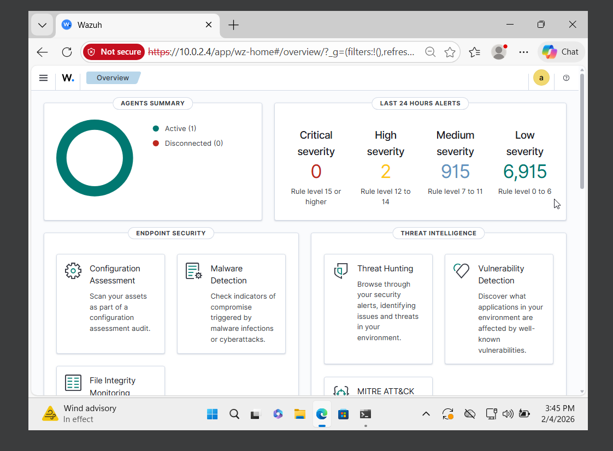
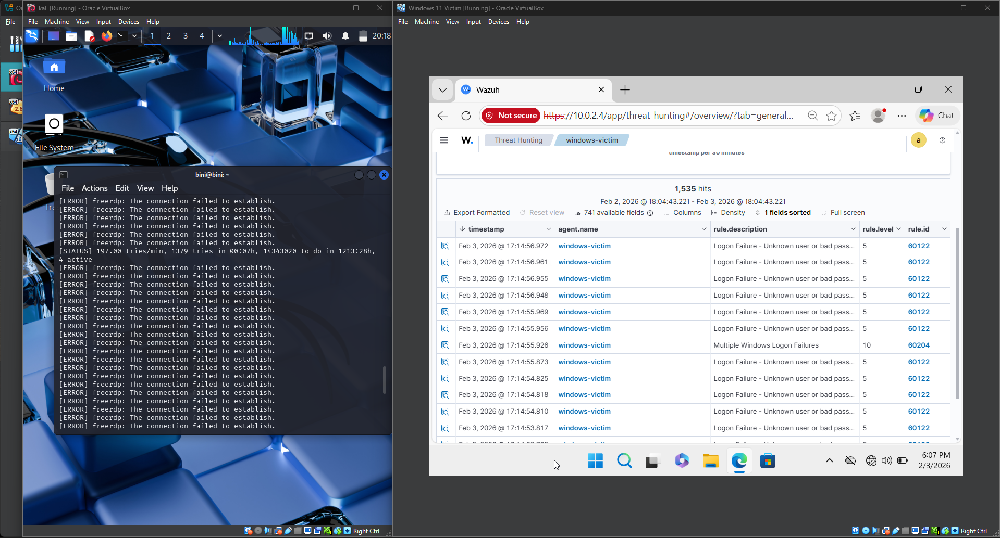
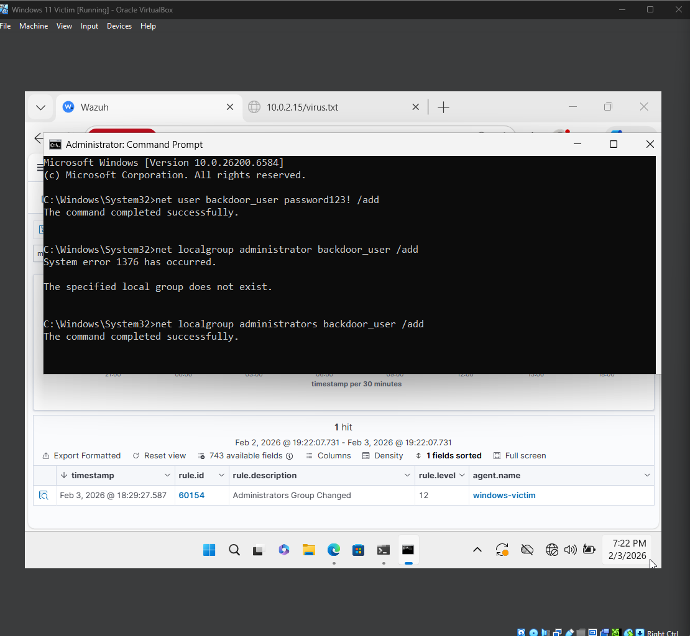

# Home-Lab-SIEM-Wazuh
Home SOC environment using Wazuh as a centralized point detect and analyze attacks.
#  Home Lab Enterprise SIEM Implementation

###  Project Overview
This project focuses on building a **Security Information and Event Management (SIEM)** system to monitor, detect, and respond to security threats in a virtualized enterprise environment. I deployed **Wazuh** as the core SIEM solution and integrated a **Windows 11 endpoint** to simulate real-world attacks.

###  Tools & Technologies
* **SIEM:** Wazuh (Manager & Dashboard)
* **Endpoint:** Windows 11 (Wazuh Agent installed)
* **Virtualization:** VirtualBox
* **Attack Tools:** Kali Linux (Hydra), Custom Scripts
* **OS:** Linux (Server), Windows (Client)

---

###  Key Activities

#### 1. Infrastructure Setup
* Deployed the **Wazuh Manager** on a Linux server to act as the central log collector.
* Configured the **Wazuh Agent** on a Windows 11 client to forward system logs (Sysmon, Security Events) to the server.

#### 2. Attack Simulation & Detection
To test the defensive capabilities, I executed the following "Red Team" scenarios:
* **Brute Force Attack:** Used Hydra on Kali Linux to flood the endpoint with RDP login attempts.
* **Privilege Escalation:** Created a backdoor user (`backdoor_user`) and added them to the local Administrators group.

#### 3. Telemetry & Analysis
* **Alert Generation:** Successfully generated **High Severity (Level 12)** alerts for the admin group modification.
* **Log Analysis:** Correlated multiple "Logon Failure" events to identify the brute force attempt pattern.

---

###  Evidence

**1. Dashboard Overview**
*Visualizing the security events and agent status.*

**2. Brute Force Detection**
*Wazuh capturing rapid "Logon Failure" events (Rule ID 60122) caused by the Hydra attack.*

**3. "Backdoor" Detection (Level 12 Alert)**
*A Critical Alert triggered when a user was added to the "Administrators" group.*

